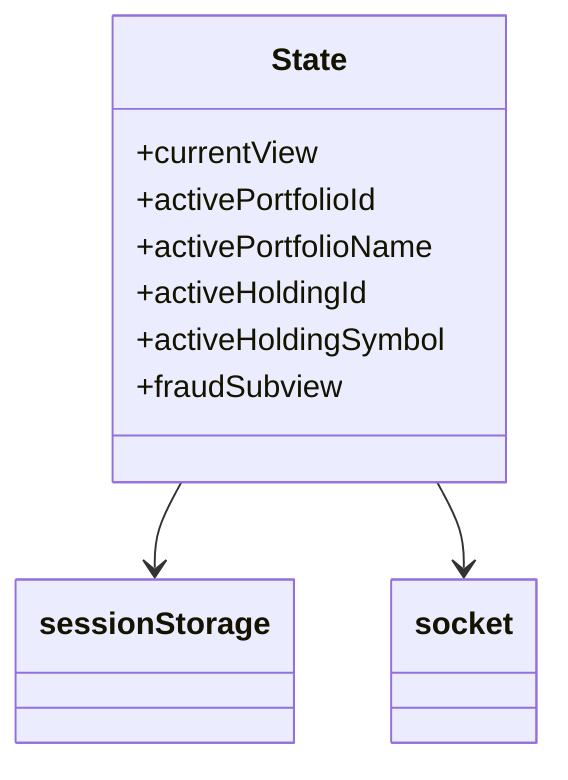
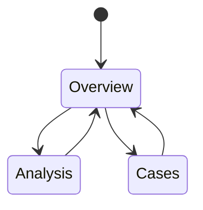
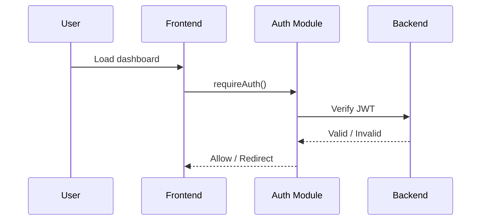

# Fin-Guard 🛡️

**Intelligent Portfolio Monitoring & Fraud Analytics Platform**

Fin-Guard is a full-stack web application for **investment portfolio management**, **market monitoring**, and **fraud analytics**.  
It is built with a **refresh-safe, event-driven frontend** and a **REST + realtime backend**, designed to resemble a real-world financial monitoring system.

---

## 🚀 Features

### 📊 Portfolio Management

- Create, view, and delete portfolios
- Portfolio-scoped holdings
- Holding-scoped transactions
- Persistent context across refresh (portfolio / holding)

### 📈 Dashboard & Market Analytics

- KPI summary (Investment, P/L, Risk)
- Portfolio history & asset allocation
- Market overview, heatmap, trending assets
- Watchlist tracking

### 🛡️ Fraud Analytics

- Fraud overview KPIs
- ML-based fraud analysis history
- User fraud case history
- Geo-risk & fraud score distribution
- Fraud test simulation
- Breadcrumb-aware fraud subviews:
  - Overview
  - Analysis History
  - Case History

### ⚡ Real-Time Updates

- Socket.IO integration
- Live updates for portfolios, holdings, and transactions
- Optional fraud alerts on transaction events

### 👤 User & Premium System

- JWT-based authentication
- Protected routes
- Premium feature gating
- Profile management

---

## 🧱 Tech Stack

### Frontend

- Vanilla JavaScript (ES Modules)
- Tailwind CSS
- Event-driven UI (no framework)
- Chart.js
- Socket.IO client

### Backend

- Node.js + Express
- Sequelize ORM
- MySQL
- JWT Authentication
- Yahoo Finance API
- Socket.IO server

---

## 📁 Project Structure

```

fin-guard/
│
├── public/
│   ├── index.html
│   └── js/
│       ├── core/          # auth, api, state, socket
│       ├── layout/        # navigation, breadcrumb, profile
│       ├── dashboard/     # dashboard & charts
│       ├── portfolio/     # portfolios, holdings, transactions
│       ├── market/        # market, watchlist, heatmap
│       ├── fraud/         # fraud analytics modules
│       ├── alerts/        # alerts & risk notifications
│       ├── premium/       # premium feature logic
│       └── user.js        # main frontend entry
│
├── src/
│   ├── controllers/
│   ├── models/
│   ├── routes/
│   ├── services/
│   ├── middleware/
│   └── app.js
│
├── server.js
├── package.json
├── .env
└── README.md

```

---

## 🧠 Frontend Architecture

### Key Principles

- **Single Source of Truth** (`core/state.js`)
- **Event-driven UI** (`view:change`, `fraud:subview`)
- **Refresh-safe navigation**
- **Domain-isolated modules**
- **No framework lock-in**

---

## 🔁 Frontend View Flow (Mermaid)

```mermaid
flowchart LR
    A[Sidebar Click] --> B[showView(viewId)]
    B --> C[Hide All Views]
    B --> D[Show Target View]
    B --> E[Persist viewId]
    B --> F[Dispatch view:change]

    F --> G[Dashboard]
    F --> H[Portfolios]
    F --> I[Holdings]
    F --> J[Transactions]
    F --> K[Fraud Analytics]
```

---

## 🗂️ State Management (Mermaid)



---

## 🛡️ Fraud Analytics Subviews (Mermaid)



---

## 🧩 Frontend Entry Point

### `public/js/user.js`

Responsibilities:

- Authentication check
- Socket initialization
- Navigation & breadcrumb bootstrap
- Module initialization
- View restoration
- Dashboard lazy loading

---

## 🔐 Authentication Flow



---

## ⚙️ Environment Setup

### 1️⃣ Clone

```bash
git clone https://github.com/your-username/fin-guard.git
cd fin-guard
```

### 2️⃣ Install

```bash
npm install
```

### 3️⃣ Configure `.env`

```env
PORT=3000
DB_HOST=localhost
DB_USER=root
DB_PASSWORD=your_password
DB_NAME=capstonedb
JWT_SECRET=your_secret
```

### 4️⃣ Run

```bash
npm run dev
```

---

## 🧪 Development Notes

- Tailwind CDN is used for development
- Production should use Tailwind CLI / PostCSS
- Fraud ML logic is modular & extensible
- Yahoo Finance API notice may appear during runtime

---

## 📌 Project Status

| Feature                 | Status |
| ----------------------- | ------ |
| Portfolio Management    | ✅     |
| Dashboard Analytics     | ✅     |
| Market Monitoring       | ✅     |
| Fraud Analytics         | ✅     |
| Realtime Updates        | ✅     |
| Refresh Safety          | ✅     |
| Production Optimization | 🟡     |

---

## 👨‍💻 Author

Built as a **capstone-grade full-stack project**, focusing on:

- Clean architecture
- Predictable UI behavior
- Real-world finance workflows
- Maintainability over frameworks

---

## 📄 License

This project is intended for **academic, learning, and demonstration purposes**.

```

```
